## Welcome to the Bob wxo MCP servers lab!

You will learn how to:
 - Install and configure watsonx Orchestrate ADK to interact with a watsonx Orchestrate instance
 - Configure Bob MCP servers to work with the watsonx Orchestrate instance from Bob
 - Create an agent using a simple tool project with Bob in watsonx Orchestrate

### Prerequisites: Install wxo ADK

#### Join the Cloud
In your email inbox, you have received an invitation to join the Cloud. Follow the instructions in the email to join the Cloud.

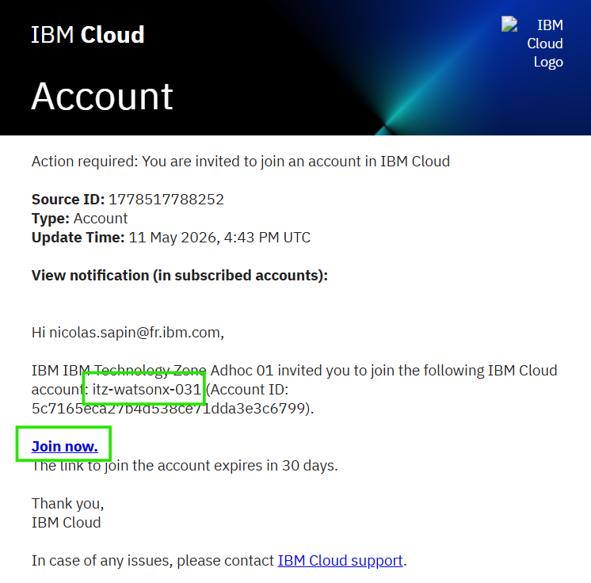


#### Get connected to [techzone](https://techzone.ibm.com) to check the status of your instance.

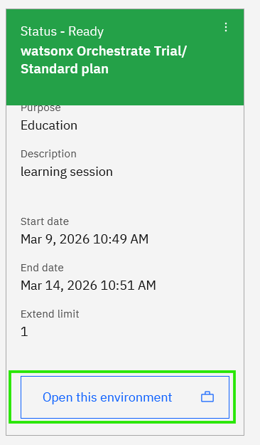

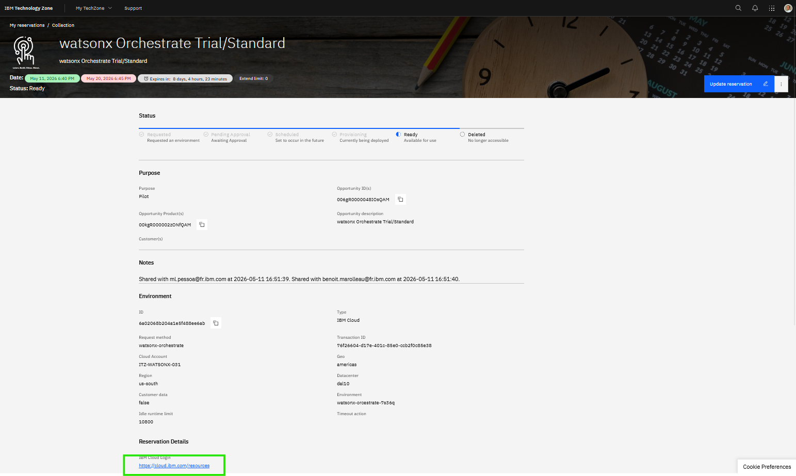

Check the cloud number in the top-right corner of your resource list page.

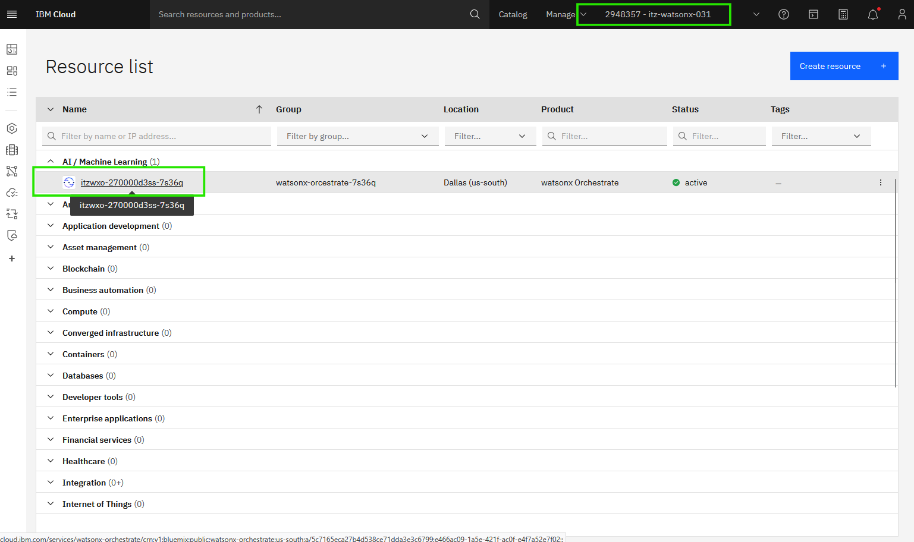

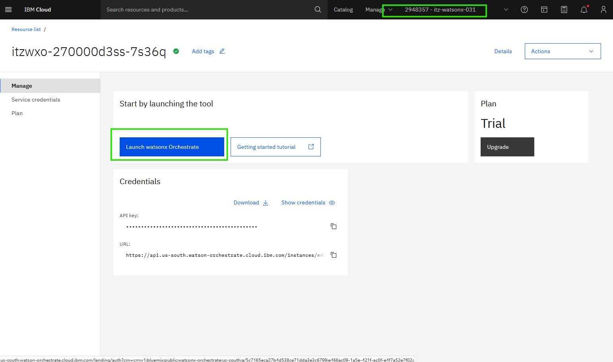


#### Install uv (if not already installed)


**Windows:**
To install uv on Windows, open PowerShell or Command Prompt and run:
```powershell
powershell -ExecutionPolicy ByPass -c "irm https://astral.sh/uv/install.ps1 | iex"
```
Alternatively, you can use pip:
```bash
pip install uv
```


**Mac:**
To install uv on Mac, open Terminal and run:
```bash
curl -LsSf https://astral.sh/uv/install.sh | sh
```
Or using Homebrew:
```bash
brew install uv
```
Or using pip:
```bash
pip install uv
```

After installation, verify uv is installed correctly by running:
```bash
uv --version
```


#### Install ADK
The current ADK requires Python 3.11 or later; anything older than 3.11 is not supported for installation.

Create a Python virtual environment with this command:
```bash
python -m venv venv
```

Activate the virtual environment:

**Windows (CMD)**:
```bash
venv\Scripts\activate.bat
```

**Windows (PowerShell)**:
```powershell
venv\Scripts\Activate.ps1
```

**Mac/Linux**:
```bash
source venv/bin/activate
```

After activation, upgrade pip and install the ADK:
```bash
pip install --upgrade ibm-watsonx-orchestrate
```

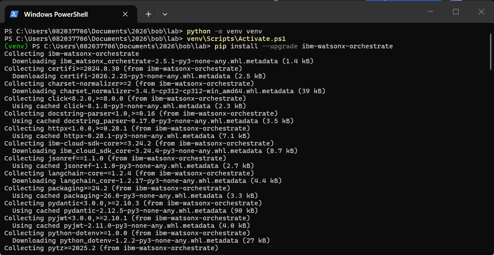


#### Configure the ADK Environment
Create the "lab" environment in the ADK with:
```bash 
orchestrate env add -u https://api.us-south.watson-orchestrate.cloud.ibm.com/instances/e466ac09-1a5e-421f-ac0f-e4f7a52e7f02 -n bobi
```
Activate the ADK environment with:
```bash
orchestrate env activate bobi -a aCC3F9pNnjfTQ8CQNrsBKnqHJJdOBPrKoPgm4ClyDW7e
```
And test it with this command that lists the agents in our watsonx orchestrate instance:
```bash
orchestrate agents list
```
and this one that lists the tools in our watsonx orchestrate instance:

```bash
orchestrate tools list
```

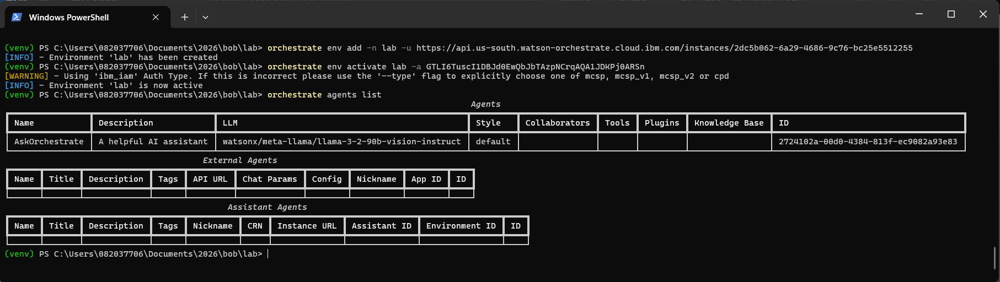


### Install and Configure the wxo MCP Servers in Bob

Go to Bob MCP servers:

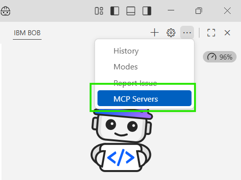

Install the watsonx Orchestrate ADK Docs MCP server:

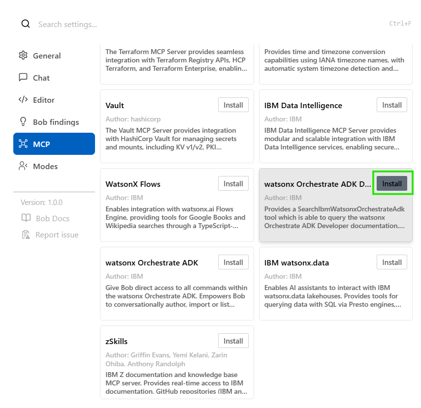

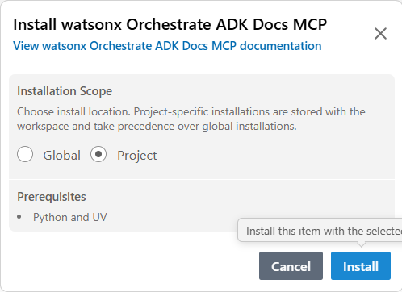

Then install the second MCP server:

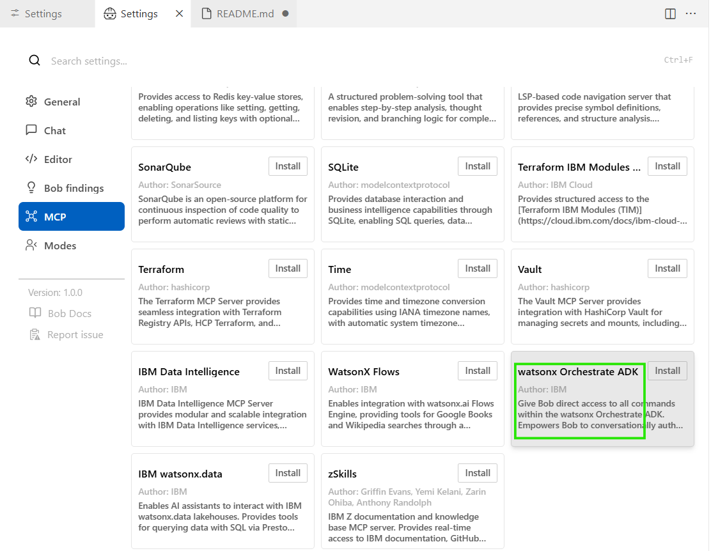

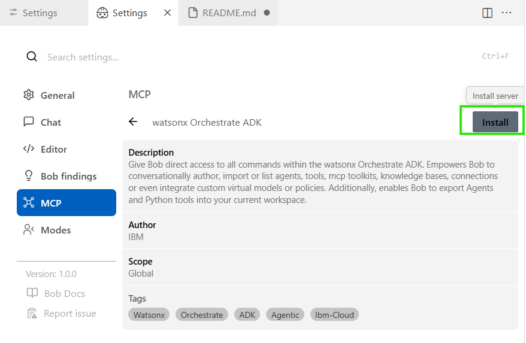

Then provide the path to your Bob repository where you and Bob will create the agent and tool files:
** the provided path MUST BE within your Bob folder ** 

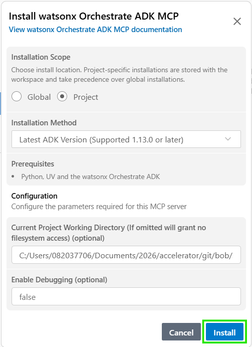

Remark:
For Windows, the correct format is something like this:
C:/Users/082037706/Documents/2026/accelerator/git/bob/bob-MCP-wxo/wxo-files

Test the ADK MCP server with a request like:
```bash
list the agents in orchestrate
```


Click "always allow" and "approve":


You will see the agents in wxo:

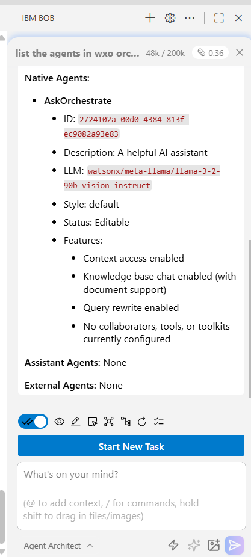

Install the 3rd wxo MCP server:

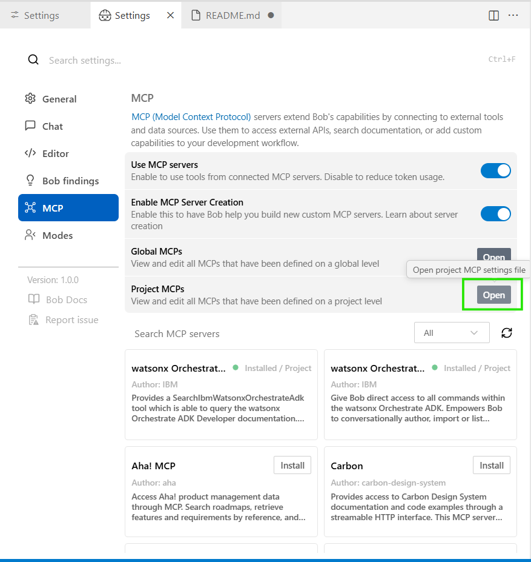

Add the following MCP server configuration in your mcp.json file.
(After the modification your file should look like : [mcp.json](images/files/mcp.json))
``` bash
        "wxo-threads": {
            "command": "uvx",
            "args": [
                "--from",
                "wxo-threads-mcp-server",
                "--index-url",
                "https://test.pypi.org/simple/",
                "--extra-index-url",
                "https://pypi.org/simple/",
                "wxo-threads-mcp-server"
            ],
            "env": {
                "WXO_API_ENDPOINT": "https://api.us-south.watson-orchestrate.cloud.ibm.com/instances/e466ac09-1a5e-421f-ac0f-e4f7a52e7f02",
                "WXO_API_KEY": "aCC3F9pNnjfTQ8CQNrsBKnqHJJdOBPrKoPgm4ClyDW7e",
                "WXO_DEFAULT_AGENT_ID": "0bb33906-0776-49e2-9b60-0bccf934b54f",
                "WXO_TIMEOUT": "30",
                "WXO_LOG_LEVEL": "DEBUG"
            },
            "timeout": 300,
            "disabled": false,
            "alwaysAllow": [
                "chat_with_agent",
                "get_last_agent_log"
            ]
        }
```


You can test chatting with the default wxo agent (the agent ID provided in the MCP configuration file) with:
Ask the wxo agent: "3 + 3 = ?"

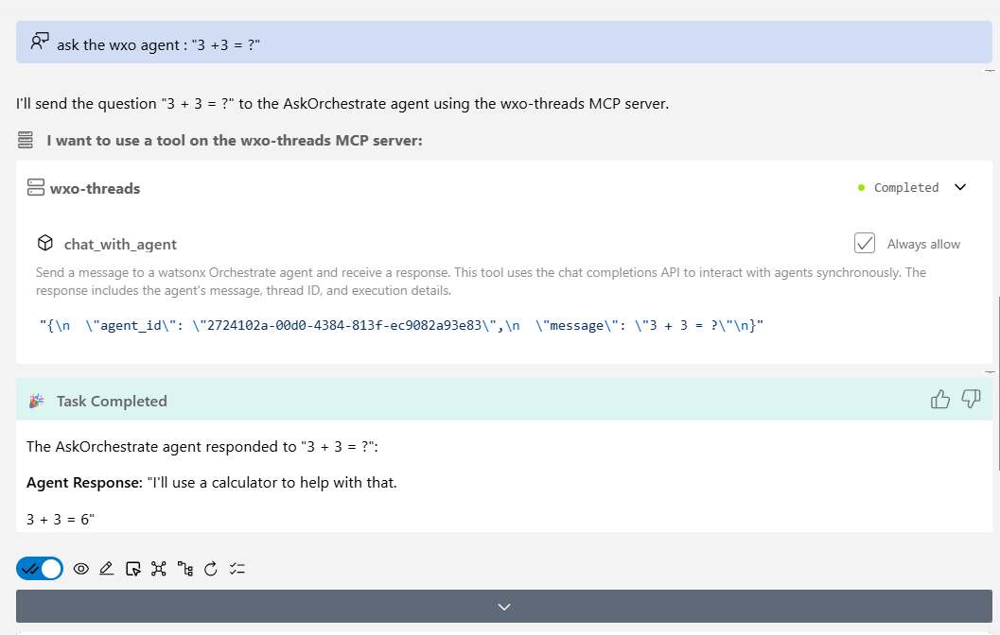

### Installing "wxo Agent Architectect" in Bob

Go to Modes in Bob:


Scroll down and install the "wxo Agent Architectect" mode:


now switch to the "wxo Agent Architectect" mode:


### Create an Agent Using a Simple Tool Project with Bob in watsonx Orchestrate

Now that the 3 MCP servers are correctly configured, we will use them to create a small project with Bob.

Create a tool that performs a loan calculation (change the path wxo-files/tools/loan_tool.py according to your project - it has to be visible by the ADK MCP server):

```bash
Write a Python tool for IBM watsonx Orchestrate that exposes a single function:

def monthly_payment(principal: float, annual_rate: float, years: int) -> float:
    ...
Functional requirements:

The function calculates the fixed monthly payment for a loan (mortgage-style amortization).

Parameters:

principal: total loan amount (float).

annual_rate: annual interest rate in percent (e.g. 4.5 for 4.5%).

years: loan duration in years (integer).

Use the standard amortization formula with monthly compounding.

Correctly handle the edge case where annual_rate is 0 (no interest).

Return the monthly payment as a float rounded to 2 decimal places.

Raise a clear error (ValueError) for invalid inputs (negative or zero principal, non-positive years, negative rate).

Code and structure requirements:

Use only the Python standard library (no external dependencies).

Add type hints and concise docstrings.

Organize the code as a watsonx Orchestrate tool:

Place the implementation in wxo-files/tools/loan_tool_XXXX.py where you have to replace XXXX with your own unique identifier.

The file must define the monthly_payment function as the main callable entry point.
```


Now ask Bob to import the tool that has been created with something like:

```bash
import the python tool you have just created in wxo.
```

Then ask Bob to create an agent file that uses this tool (change the path if necessary):

```bash
create an agent file in wxo-files\agents directory.  this agent have to use the loan_tool tool you have just created to provide information about loan payments. The name of the agent file should be loan_advisor_agent_XXXX.yaml where you have to replace XXXX with your own unique identifier. The agent should be able to answer questions about loan payments and provide the monthly payment amount for a given loan amount, interest rate, and term. The agent should be able to handle edge cases and provide clear error messages. The agent should be able to be imported in wxo.

```
Now import your newly created agent file in wxo with:
```bash
import the agent file you have just created in wxo.
```

Get the ID of your agent and use it to configure the 3rd MCP server:

```bash
What is the agent ID of the loan advisor agent you have just imported in wxo ?
```

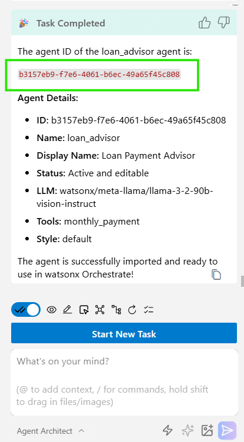

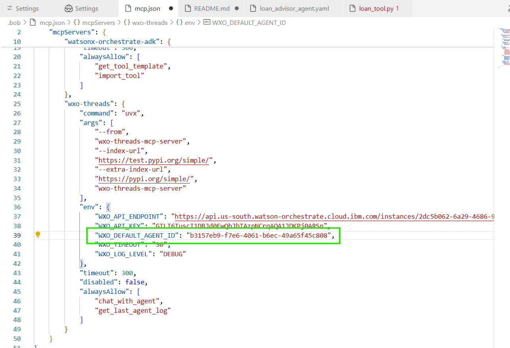

Restart the MCP server:

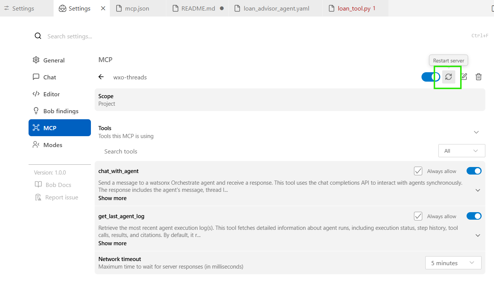

Now ask Bob to request the agent:

```bash
What would my monthly payment be for a $200,000 mortgage at 4.5% for 30 years?
```

And you can ask to get the logs from the last execution with the next command, it could be interesting to get these logs if there are errors during the agent request execution:

```bash
get the logs from the execution of the loan advisor agent.
```

You can also connect to the wxo UI to query the agent:


BONUS:

Use Case: Currency Converter Agent

Objective

Create a helpful Currency Converter Agent that can instantly convert any amount between world currencies (e.g. “Convert 250 EUR to USD” or “What is 1500 GBP in JPY?”).
What you will build

A Python tool (currency_converter_tool.py) that calls the free Frankfurter API (no API key required)
An agent (currency_converter_agent.yaml) that uses this tool

Your mission

Ask Bob to create the Python tool that contains a function convert_currency(amount, from_currency, to_currency).

Ask Bob to create the agent file that uses this tool.

Import both the tool and the agent into watsonx Orchestrate using the ADK MCP server (same method as the loan calculator).

Test your agent by asking Bob or the watsonx Orchestrate UI questions like:

“Convert 500 EUR to USD”

“How much is 1200 GBP in CAD?”